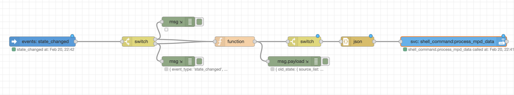

# Introduction

I was looking for a project to help me learn/practice more python & I like to listen to music and scrobble to last.fm throughout the day.  The players I use are all integrations in hass, but one of them only scrobbled tracks from my own library and not from any streaming service and I wanted a single scrobbling solutiion and not one i'd have to select/manage player by player.  So, I decided to write my own.

On hass, I use the forked-daapd and mpd integrations and for players i use forked-daapd, Cantata (linux/macos mpd music client) and bubbleupnp on android with upmpdcli as a upnp renderer for mpd (allows bubbleupnp to play to mpd).  To achieve whole home audio, i couple  this with snapcast, shairport-sync & Sonos.

# Setup

You'll need at least python 3.8.0 - if using the version of python used by hass you should be fine otherwise a version of at least 3.8 running in a venv or on another machine is fine.  If you run on hass, the automation will deliver the media event data directly to your hass' python.  The other way to do this is have the automation dump the media event data to a text file (for example that has persistant storage via a directory on your host machine) and then discover the changes to the text file on the host with something like inotifywait.

The other thing you'll need is a last.fm API key - go to https://last.fm/api and create an API account - you'll want to note your api_key and api_secret (aka shared secret).  If you didn't write them down, you can find them again at https://last.fm/api/accounts.  The other thing you should do is create is a session key - you can  use this without a session key but this will require some slight code modification.  Session keys last forever (or until you disconnect the app associated with it) and this way you don't have to store your last.fm password in the code.  I've documented session key creation below.

## Gather the things you'll need:

* connect into your hass instance (e.g., ssh, docker exec -it...)
* change directory to the home folder of the user that runs hass - this should be parent folder of your .homeassistant folder.
* clone the repository - `git clone https://github.com/yajrendrag/ha-scrobbler.git ha-scrobble`
* python 3 dependencies: pylast, httpx, json, time, sys, re, subprocess, datetime, shutil, SimpleNamespace from types, and BeautifulSoup from bs4.  requirements.txt contains the packages to install.

## Put things into place

### Automation

You'll need some automation in HA to extract media player events to feed the scrobbler and you'll the entity id(s) of the media players you're using.

* If using yaml automation, here's an example automation that will send the captured media player event data (in this case from forked_daapd_server - set this to match the media player you're using - you may be able to set multiple media players here) to your shell command:

```yaml
- alias: 'capture media player events'
  trigger:
    platform: event
    event_type: state_changed
    event_data:
      entity_id: media_player.forked_daapd_server # modify to match your media player
  condition:
    condition: template
    value_template: "{{ trigger.event.data['new_state']['state'] == 'playing' or trigger.event.data['old_state']['state'] == 'playing' }}"
  action:
    - service: shell_command.process_mpd_data
      data_template:
        mpd_data: >
          '{{
            {
            "old_state": {"media_content_type": trigger.event.data['old_state']['attributes']['media_content_type'] | default(""),
                          "media_content_id": trigger.event.data['old_state']['attributes']['media_content_id'] | default(""),
                          "media_position_updated_at": as_timestamp(trigger.event.data['old_state']['attributes']['media_position_updated_at']) | timestamp_custom('%Y-%m-%dT%H:%M:%S.%f%z',False) | default(""),
                          "media_title": trigger.event.data['old_state']['attributes']['media_title'] | default("") | replace("'",""),
                          "media_artist": trigger.event.data['old_state']['attributes']['media_artist'] | default("") | replace("'",""),
                          "media_duration": trigger.event.data['old_state']['attributes']['media_duration'] | default(""),
                          "media_position": trigger.event.data['old_state']['attributes']['media_position'] | default(""),
                          "media_track": trigger.event.data['old_state']['attributes']['media_track'] | default(""),
                          "media_album_name": trigger.event.data['old_state']['attributes']['media_album_name'] | default(""),
                          "media_album_artist": trigger.event.data['old_state']['attributes']['media_album_artist'] | default(""),
                          "source": trigger.event.data['old_state']['attributes']['source'] | default(""),
                          "friendly_name": trigger.event.data['old_state']['attributes']['friendly_name'] | default(""),
                          "entity_picture": trigger.event.data['old_state']['attributes']['entity_picture'] | default(""),
                          "source_list": trigger.event.data['old_state']['attributes']['source_list'] | default("")
                         },
            "new_state": {"media_content_type": trigger.event.data['new_state']['attributes']['media_content_type'] | default(""),
                          "media_content_id": trigger.event.data['new_state']['attributes']['media_content_id'] | default(""),
                          "media_position_updated_at": as_timestamp(trigger.event.data['new_state']['attributes']['media_position_updated_at']) | timestamp_custom('%Y-%m-%dT%H:%M:%S.%f%z',False) | default(""),
                          "media_title": trigger.event.data['new_state']['attributes']['media_title'] | default("") | replace("'",""),
                          "media_artist": trigger.event.data['new_state']['attributes']['media_artist'] | default("") | replace("'",""),
                          "media_duration": trigger.event.data['new_state']['attributes']['media_duration'] | default(""),
                          "media_position": trigger.event.data['new_state']['attributes']['media_position'] | default(""),
                          "media_track": trigger.event.data['new_state']['attributes']['media_track'] | default(""),
                          "media_album_name": trigger.event.data['new_state']['attributes']['media_album_name'] | default(""),
                          "media_album_artist": trigger.event.data['new_state']['attributes']['media_album_artist'] | default(""),
                          "source": trigger.event.data['new_state']['attributes']['source'] | default(""),
                          "friendly_name": trigger.event.data['new_state']['attributes']['friendly_name'] | default(""),
                          "entity_picture": trigger.event.data['new_state']['attributes']['entity_picture'] | default(""),
                          "source_list": trigger.event.data['new_state']['attributes']['source_list'] | default("")
                         },
             "time_new": as_timestamp(trigger.event.data['new_state']['last_updated']) | timestamp_custom('%Y-%m-%dT%H:%M:%S.%f%z',False),
             "time_old": as_timestamp(trigger.event.data['old_state']['last_updated']) | timestamp_custom('%Y-%m-%dT%H:%M:%S.%f%z',False),
             "state_new": trigger.event.data['new_state']['state'],
             "state_old": trigger.event.data['old_state']['state']
             } | to_json
          }}'
```

* If using nodered, here's a nodered flow you can use:



and it's associated json (this is scrubbed so you won't get my config nodes):
```json
[{"id":"edd0c8b3.2d4b98","type":"api-call-service","z":"15a7ec87.0d5de3","name":"","server":"","version":1,"debugenabled":true,"service_domain":"shell_command","service":"process_mpd_data","entityId":"","data":"{\"mpd_data\":\"{{ payload }}\"}","dataType":"json","mergecontext":"","output_location":"payload","output_location_type":"msg","mustacheAltTags":false,"x":1560,"y":1340,"wires":[[]]},{"id":"cebc0403.8a92b8","type":"json","z":"15a7ec87.0d5de3","name":"","property":"payload","action":"str","pretty":false,"x":1270,"y":1340,"wires":[["edd0c8b3.2d4b98"]]},{"id":"3c1b8967.b0e386","type":"switch","z":"15a7ec87.0d5de3","name":"","property":"payload","propertyType":"msg","rules":[{"t":"nempty"}],"checkall":"false","repair":false,"outputs":1,"x":1110,"y":1340,"wires":[["cebc0403.8a92b8"]]},{"id":"b2b568a6.3d83f8","type":"debug","z":"15a7ec87.0d5de3","name":"","active":true,"tosidebar":true,"console":true,"tostatus":true,"complete":"payload","targetType":"msg","statusVal":"payload.mpd_data","statusType":"auto","x":1080,"y":1400,"wires":[]},{"id":"b375c8fb.982058","type":"function","z":"15a7ec87.0d5de3","name":"","func":"if (msg.payload['event']['new_state']['state'] != \"playing\" & msg.payload['event']['old_state']['state'] != \"playing\") {\n    msg.payload = {};\n} else {\n    msg.payload = {\n    \"old_state\": msg.payload['event']['old_state']['attributes'],\n    \"new_state\": msg.payload['event']['new_state']['attributes'],\n    \"time_new\": msg.payload['event']['new_state']['last_updated'],\n    \"time_old\": msg.payload['event']['old_state']['last_updated'],\n    \"state_new\": msg.payload['event']['new_state']['state'],\n    \"state_old\": msg.payload['event']['old_state']['state']\n    };\n}\nreturn msg;","outputs":1,"noerr":0,"initialize":"","finalize":"","x":900,"y":1340,"wires":[["3c1b8967.b0e386","b2b568a6.3d83f8"]]},{"id":"304af530.402d7a","type":"debug","z":"15a7ec87.0d5de3","name":"","active":true,"tosidebar":true,"console":true,"tostatus":true,"complete":"true","targetType":"full","statusVal":"payload.mpd_data","statusType":"auto","x":730,"y":1280,"wires":[]},{"id":"f859550b.28f4e8","type":"debug","z":"15a7ec87.0d5de3","name":"","active":true,"tosidebar":true,"console":true,"tostatus":true,"complete":"true","targetType":"full","statusVal":"payload.mpd_data","statusType":"auto","x":730,"y":1400,"wires":[]},{"id":"332d9c19.72a274","type":"switch","z":"15a7ec87.0d5de3","name":"","property":"payload.entity_id","propertyType":"msg","rules":[{"t":"cont","v":"media_player.mpd","vt":"str"},{"t":"cont","v":"media_player.forked_daapd_server","vt":"str"}],"checkall":"false","repair":false,"outputs":2,"x":610,"y":1340,"wires":[["b375c8fb.982058","304af530.402d7a"],["f859550b.28f4e8","b375c8fb.982058"]]},{"id":"26ae070f.9c2a18","type":"server-events","z":"15a7ec87.0d5de3","name":"","server":"","event_type":"state_changed","exposeToHomeAssistant":false,"haConfig":[{"property":"name","value":""},{"property":"icon","value":""}],"waitForRunning":true,"x":320,"y":1340,"wires":[["332d9c19.72a274"]]}]
```

You'll need to modify the first switch node to match your media player(s).
### Python Setup

You can choose to run this in a Hass machine python environment - i.e., in your hass machine (a bare metal machine or a container, in a separate venv or using the same or separate version of python in that machine) - OR,  you can opt to run in a python environment outside of your hass machine, ie, pass the media player event data to another machine.  The latter use case includes running on the host of the machine on which hass is running as a container.

#### Hass Machine Python setup

* Put processmpd.sh in /home/YOUR-HASS-USER/.homeassistant/shell_commands.  Make it executable, `chmod +x processmpd.sh`.
* create directory /home/YOUR-HASS-USER/ha-scrobble owned by the user running hass.
* Put ha-scrobble.py in this directory and make it executable, `chmod +x ha-scrobble.py`.  Set file ownership to YOUR-HASS-USER, eg., `chown YOUR-HASS-USER:YOUR-HASS-USER /home/YOUR-HASS-USER/ha-scrobble/ha-scrobble.py`
* `touch /home/YOUR-HASS-USER/ha-scrobble/ha-scrobble.log`.  Various events are logged & I left a lot of the logging intact in ha-scrobble.py, although some is commented out.  As long as you don't run into issues, you could comment it all out if you don't want deal with maintaining the log file (see below for logrotate).
* `touch /home/YOUR-HASS-USER/ha-scrobble/stackfile.txt` owned by your hass user.  It's a stack of sorts - a file to hold the last track that was playing.
* create a shell command in your hass configuration - here's an example:
  `process_mpd_data: /home/YOUR-HASS-USER/.homeassistant/shell_commands/processmpd.sh {{ mpd_data }}` - regardless of node red or yaml automation this will pass the media event data to the processmpd.sh shell script to start the scrobbling activity.
* edit lines 15-25 of ha-scrobbe.py and edit the entries for your last.fm account data (API_KEY, API_SECRET, SESSION_KEY, USER_NAME) and global data (logfile and stackfile paths, and the SUFFIX_LIST which is simply a list of suffixes for files in your music library, e.g., ".flac").

#### Python outside of Hass

If you wish to run this outside of hass then you need to modify the shell script, processmpd.sh, effectively breaking it up into multiple scripts.  I have commented processmpd.sh with instructions on waht to modify and the 2 additional scripts needed are also included with comments in the repo.

The processmpd.sh script should be modififed to only write the media event data to a file, e.g., ha-scrobble/mpd-events.txt  A second script, processmpd-events.sh, would read the last line of mpd-events.txt and call the ha-scrobble.py function.  The trick to this is to figure out how to trigger the second script outside of hass.  One way to do that is to link your hass ha-scrobble container folder to a similar folder on the host.  If, for example, you're running hass in a container (which most non homeassistant-core implementations seem to do), you could map the ha-scrobble folder in the hass container to a host folder by using a -v option on your hass container run command, e.g., `-v /home/user/ha-scrobble:/home/hass-user/ha-scrobble`.  Then inotifywait could be used to monitor the host file mpd-events.txt for changes.  

To effect this, install inotifywait tools - e.g., on ubuntu/debian `sudo apt update -y && sudo apt install -y inotify-tools`.  Then you need a (3rd) script, scrobble-notifier.sh, like this:
```bash
#!/bin/bash
#if you have a mail MTA installed and/or require mail for cron, comment this out or set to appropriate value
MAILTO=""

while inotifywait -e modify /home/user/ha-scrobble/mpd-events.txt; do /usr/local/bin/processmpd-events.sh; done
```
Save that as scrobble-notifier.sh some place - e.g., /usr/local/bin on the host and make it executable by the user that will run ha-scrobble.py on the host.

Add a crontab entry for that same user to run this script on boot - for example `crontab -e` and then add this to the end and save:
`@reboot /usr/local/bin/scrobble-notifier.sh >/dev/null 2>&1`

Finally, put ha-scrobble.py on the host somewhere, e.g., /usr/local/bin and add /usr/local/bin/processmpd-events.sh that would contain something like this:
```bash
#!/bin/bash

x=$(tail -1 /home/user/ha-scrobble/mpd-events.txt)
/usr/local/bin/ha-scrobble.py "$x"
```

Now hass will simply dump media player events to a text file in the container, inotifywait on the host will see that the file has been changed on disk and will execute processmpd-events.sh which will get the last line in the file and call ha-scrobble.py.  The github repo contains the additional 2 shell scripts with comments to help set this up and comments in the original script, processmpd.sh to change it to fit this scenario.

##### A Simpler solution outside of Hass for Nodered
A simpler alternative if you're using nodered is to not return the mpd_data to a hass shell command and instead call a python script directly from nodered.  To do this, you'd have to change the final node in the above nodered flow; instead of calling a homeassistant shell command service, you could call a python script from within node red with the mpd_data as an argument.  If you go this route, you don't need the shell command added to your hass configuration.

# Media Player Events

## High Level Data Flow

As media plays within hass, media player events are generated and the above automation processes these media player events.  Processing simply means that event data is captured and sent to your shell command.  I've observed that the different music player integrations generate events at different frequencies.  mpd seems to generate an event about every 10 seconds.  forked-daapd seems to generate much fewer events (sometimes only 1 per track) and they seem to vary as a function of source, e.g., internet radio station vs a local library file.  Plex seems to generate 1 event per track played.  Regardless, the automation sends the captured json string (mpd-data) to the shell command which simply calls ha-scrobble.py with the json string as an argument.  ha-scrobble.py then does it's thing - since multiple events are potentially captured per playing track, each time it's invoked, ha-scrobble.py has to determine if the track is scrobble-able.  last.fm instructs that a track is only scrobble-able if it's duration is at least 30 seconds; and moreover, it cannot be scrobbled before it has played at least half of it's duration or has played longer than 240 seconds.  So, if it's not scrobble-able, ha-scrobble.py does nothing; otherwise, if it meets the condiditions for scrobbling, it scrobbles the track.  The log file captures the relevant details per above.

## Media Player Event Data

Media player events typically contain an old state and a new state - the track that was playing in the previous event and the track that is now playing (Plex seems to only contain a new state).  ha-scrobble.py examines the new and old state tracks and compares them with the track in stackfile.txt to determine if the track is scrobble-able.  The current writes the new track,  old track, and the popped track as well as if the track is scrobbled to ha-scrobble/ha-scrobble.log.  Just before scrobbling, ha-scrobble checks the last 3 tracks scrobbled to the user's last.fm account to ensure that we've haven't already scrobbled the track; since a track can become scrobble-able before it ends (e.g., if has played for half it's duration or longer), it's possible in the overall media flow that a track could be scrobbled and then appear in a subsequent media player event and still meet the criteria to be scrobbled.  To avoid scrobbling it multiple times, we check that the track is not one of the last 3 scrobbled tracks during a time window equal to twice the track duration.  These 3 tracks are also logged.  If the track in the new state is different than the old track (and the other criteria are the same - meaning the source, e.g., a radio station, hasn't changed), then the track on the stack is replaced with the new state track.

## Event Parsing

Determining a track's artist, title & duration from the media player event may need to be parsed from the media event data or they may be easily accessible.  This is dependent on several factors (local file vs internet stream, player, and how the internet stream furnishes that info and how hass parses that into media player event data).  Thus, you may find that you need to make changes to the code if the logic in ha-scrobble.py doesn't function properly.  Here's what i've observed and have done currently.

* Local files clearly identify artist, title, and duration, so this case is easy.  The SUFFIX_LIST parameter is used to help identify if a source is a local file.  My whole local music library is ripped to flac and i have a few purchased tracks that were only available as mp3's, so, my SUFFIX_LIST is (".flac", ".mp3").  Adjust this parameter for your music library as needed.
* ha-srobble.py uses several fields returned in media player event data in conjunction with above to determine if the source is a radio station or a local file - artist, media_content_id and media_track.  They contain different data depending on the source and player integraiton:
	* media_track is 0 when forked_daapd is playing a radio station and > 0 (it's the actual track # in the album) if playing a local music file
	* with mpd, media_content_id is the name of the file if playing a local file - hence why you need the SUFFIX_LIST to contain a list of your music file suffixes
	* artist string is empty and media_content_id contains the url (starts with http) of the radio station when an mpd client is playing a radio station and moreover artist and title have to be parsed from the title string (private __parse_title function)

The above criteria enable me to directly extract title, artist and duration (all needed for scrobbling) or parse the supplied fields into the 3 required fields in order to be able to successfully scrobble the track.

You may find that other music players you use may necessitate additional criteria and you'll want to integrate the changes in the event class private funciton of __parse_event_data.  Alternatively, let me know what you find and i'll try to help update this code section.

# log file rotation

here's a logrotate script you can use with your logfile:

```bash
/home/YOUR-HASS-USER/ha-scrobble/ha-scrobble.log {
    hourly
    rotate 7
    compress
    missingok
    notifempty
    create 0644 YOUR-HASS-USER YOUR-HASS-USER
    su YOUR-HASS-USER YOUR-HASS-USER
}
```
Keep this in `/home/YOUR-HASS-USER/ha-scrobble` as a file named hascrobble.lr and add a crontab entry for YOUR-HASS-USER something like:
`22 */4 * * * /usr/sbin/logrotate -f /home/YOUR-HASS-USER/ha-scrobble/hascrobble.lr --state /home/YOUR-HASS-USER/ha-scrobble/status`  Modify paths if you're running ha-scrobble outside of hass.

This way you can run it at your own schedule and not have to change any OS level settings for logrotate.

# Accessing your Last.fm history

After scrobbling tracks you may wish to download your listening history.  Here are a few options:
* you can simply access via a web browser from the library seciton of your last.fm account.
* there are a few reporting tools [save to csv](https://benjaminbenben.com/lastfm-to-csv/) and [export](https://lastfm.ghan.nl/export/) you can use to download your history

# Generating a Last.fm Session Key

1. You can read all of this from the API documentation at https://www.last.fm/api/desktopauth, but i've put the salient bits below with a few explanatory notes/examples in a few spots.
2. send an http get request to [http://ws.audioscrobbler.com/2.0/?method=auth.gettoken&api_key=YOUR_API_KEY_HERE&format=json](http://ws.audioscrobbler.com/2.0/?method=auth.gettoken&api_key=YOUR_API_KEY_HERE&format=json) - you can do this from a browser, use curl, python requests or httpx... whatever.  it will return json with {"token": "YOUR_API_TOKEN_HERE"}.  this is only good for 60 minutes.
3. open a browser and log into last.fm if not already logged in.  In another browser tab, go to [http://www.last.fm/api/auth/?api_key=YOUR_API_KEY_HERE&token=YOUR_API_TOKEN_HERE](http://www.last.fm/api/auth/?api_key=YOUR_API_KEY_HERE&token=YOUR_API_TOKEN_HERE) - this will end up taking you to a page to grant authorization to use the application.
4. assemble the following string:
   "api_keyYOUR_API_KEY_HEREmethodauth.getSessiontokenYOUR_API_TOKEN_HEREYOUR_API_SECRET_HERE" and then get the md5 hash of this.  You can do this in a few ways:
	- from a shell: `echo -n "api_keyYOUR_API_KEY_HEREmethodauth.getSessiontokenYOUR_API_TOKEN_HEREYOUR_API_SECRET_HERE" | md5sum`
	- from python3 - open python3 from shell, `import pylast` and then issue: `pylast.md5("api_keyYOUR_API_KEY_HEREmethodauth.getSessiontokenYOUR_API_TOKEN_HEREYOUR_API_SECRET_HERE")`
both of these will yield a 32 character md5 hash of the above string. this is your api_sig in params below.
5. send an https post:
   e.g., from python3:
   ``` python
   import httpx
   url = "http://ws.audioscrobbler.com/2.0/"
   params = {"method": "auth.getSession", "api_key": "YOUR_API_KEY_HERE", "token": "YOUR_API_TOKEN_HERE", "api_sig": "32 character md5 hash from above"}
   response = httpx.post(url, params)
   ```
   if all worked as it should you should end up with an xml response like this and you're session key is the `<key>` value:
   ```xml
   <lfm status="ok">
   <session>
   <name>your last fm user id here</name>
   <key>A SESSION KEY HERE</key>
   <subscriber>0</subscriber>
   </session>
   </lfm>
   ```
